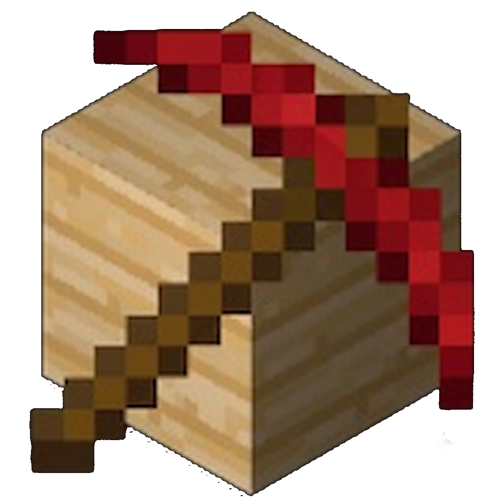

    
    <h1>mine-build</h1>
    
    

 
<h1>MINE-BUILD A FORK of lunati</h1> 

<h2>dev(s):drred</h2>
<h3>ENGINE IS OPEN SOURCE</h3>
<h4>GAME IS NOT OPEN SOURCE</h4>
<ins>IT IS RECOMMEND TO MODIFY LUNATI INSTEAD </ins>
<h5>ENGINE VERSION: 1</h5>
<h6>GAME VERSION: 1.5</h6>
<ins>contact the dev by finding the contact is information in MINE-BUILD</ins>
<ins>HAVE FUN.</ins>

